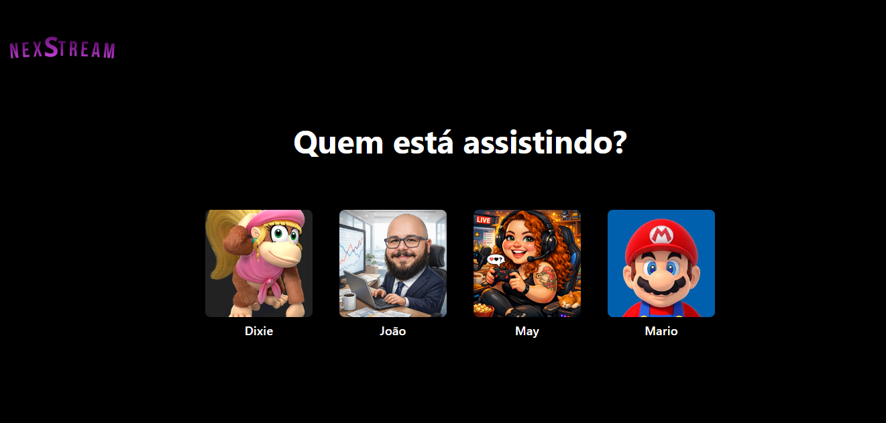
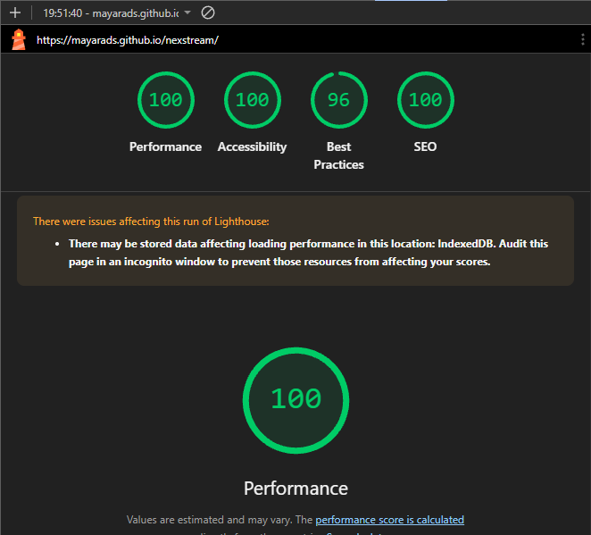

# NexStream - Plataforma de Streaming Responsiva 🎬

O **NexStream** é uma plataforma de streaming moderna e totalmente responsiva, projetada para oferecer uma experiência de navegação fluida, intuitiva e imersiva, contando com uma tela interativa de seleção de perfis de usuário. O projeto foi desenvolvido com foco em arquitetura limpa, semântica estrutural, alta performance e acessibilidade web.

🌐 **Acesse o projeto na prática:** [NexStream no GitHub Pages](https://mayarads.github.io/nexstream/)

---

## 📱 Preview da Aplicação

<p align="center">
  
</p>

---

## 📊 Performance e Otimização Técnica (Google Lighthouse)

A aplicação foi submetida à auditoria oficial do Google Lighthouse, alcançando métricas excelentes que comprovam o alto padrão de otimização, velocidade e acessibilidade do código:

<p align="center">
  
</p>

* **Performance:** 100/100 ⚡
* **Acessibilidade:** 100/100 ♿
* **Melhores Práticas:** 96/100 🛠️
* **SEO:** 100/100 🔍

---

## 🎯 Problema que o projeto resolve

Plataformas de streaming costumam sofrer com lentidão no carregamento devido ao excesso de mídias e scripts mal otimizados, prejudicando a experiência do usuário e o ranqueamento nos motores de busca. O **NexStream** resolve esse problema ao entregar uma interface rica visualmente, totalmente multiplataforma (mobile, tablet e desktop), mantendo o código extremamente leve, acessível para tecnologias assistivas e otimizado para carregamento instantâneo.

## 🛠️ Tecnologias Utilizadas

* **HTML5:** Estruturação altamente semântica para garantir a máxima eficiência em acessibilidade e indexação SEO.
* **CSS3:** Estilização moderna e avançada com foco em responsividade, uso de temas escuros (Dark Mode) e design fluido.
* **JavaScript Vanilla:** Recursos nativos para interações dinâmicas e controle de carregamento da interface.
* **Git & GitHub:** Versionamento de código profissional utilizando fluxo baseado na branch `main`.
* **GitHub Pages:** Deploy automatizado e hospedagem da aplicação.

## ✨ Principais Diferenciais Técnicos

* **Mobile-First & Responsividade:** Interface adaptada perfeitamente para qualquer tamanho de tela.
* **Zero Bloqueio de Renderização:** Otimização de entrega de estilos e scripts para garantir carregamento imediato.
* **Acessibilidade Nativa (WCAG):** Contraste de cores ajustado, tags semânticas corretas e suporte a leitores de tela.

## 📦 Como rodar o projeto localmente

1. Clone este repositório para a sua máquina:
   ```bash
   git clone [https://github.com/mayarads/nexstream.git](https://github.com/mayarads/nexstream.git)